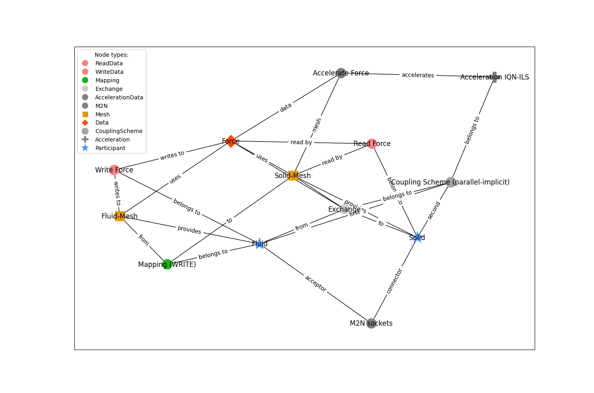

This examples represents the most basic configuration. It was directly inspired by preCICE's workshop example for beginners to start learning preCICE.

Since it contains only a uni-directional data exchange and only data point, its not a fully functional configuration. 

