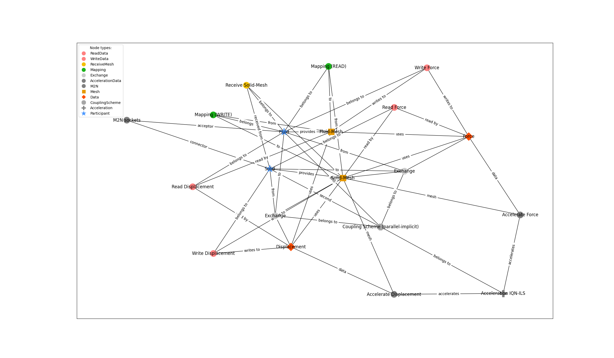
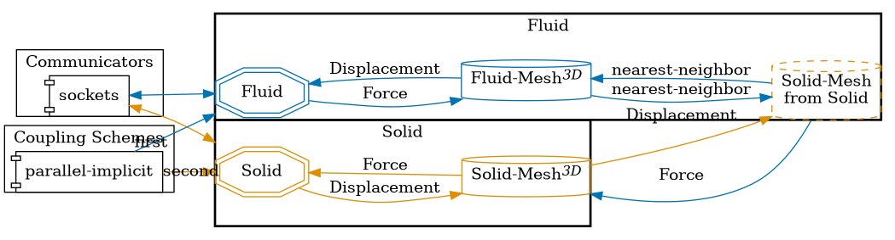

This is a standard and very basic example of a preCICE configuration with 2 participants and simple bi-directional data exchange.

The coupling scheme uses standard display values for properties like max-time, etc.

