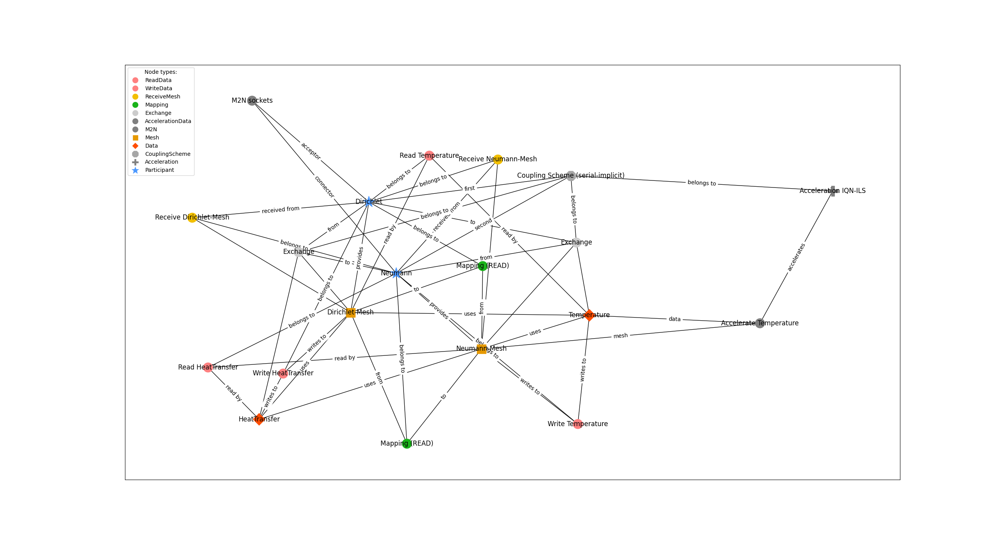

This is a first 'Expert' example, which contains more complex acceleration definitions. It is a identical example to example 4, hence name "4".

This accelerations implements a filter which has a type and a limit.

